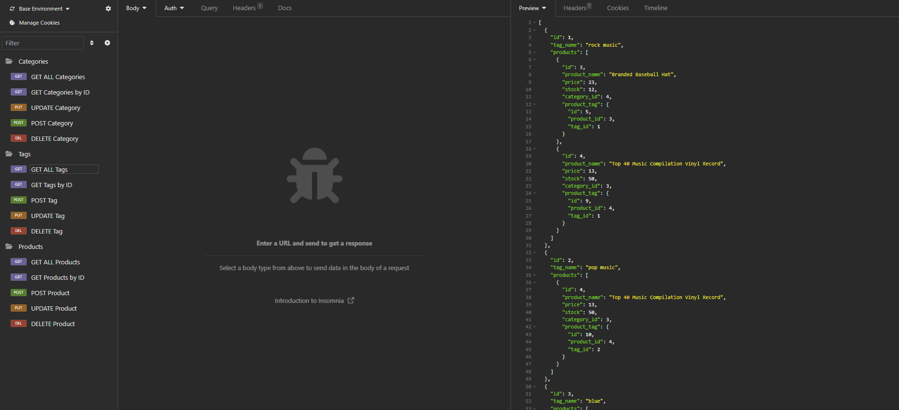
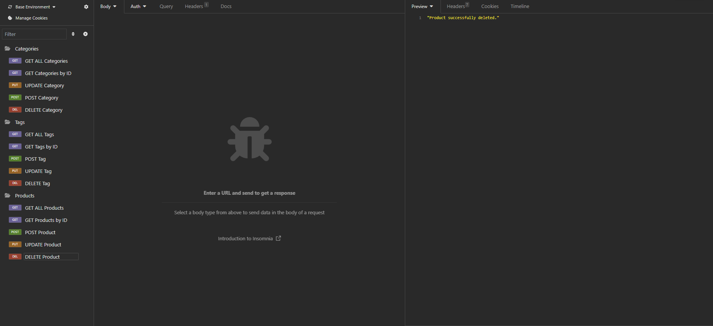

# Challenge 13: E-Commerce Backend 2023
### Description:
This week, my challenge was to build the backend for an e-commerce site. I was to take a working Express.js API and configure it to use Sequelize to interact with a MySQL database.

# Table of Contents:
1. [License](#License)
2. [Usage](#usage)
3. [Installation](#installation)
4. [Questions](#questions)
5. [Contributing](#contributing)
6. [Contact](#contact)

# License:

Copyright (c) 2023 Austin Drury

Permission is hereby granted, free of charge, to any person obtaining a copy of this software and associated documentation files (the "Software"), to deal in the Software without restriction, including without limitation the rights to use, copy, modify, merge, publish, distribute, sublicense, and/or sell copies of the Software, and to permit persons to whom the Software is furnished to do so, subject to the following conditions:

The above copyright notice and this permission notice shall be included in all copies or substantial portions of the Software.

THE SOFTWARE IS PROVIDED "AS IS", WITHOUT WARRANTY OF ANY KIND, EXPRESS OR IMPLIED, INCLUDING BUT NOT LIMITED TO THE WARRANTIES OF MERCHANTABILITY, FITNESS FOR A PARTICULAR PURPOSE AND NONINFRINGEMENT. IN NO EVENT SHALL THE AUTHORS OR COPYRIGHT HOLDERS BE LIABLE FOR ANY CLAIM, DAMAGES OR OTHER LIABILITY, WHETHER IN AN ACTION OF CONTRACT, TORT OR OTHERWISE, ARISING FROM, OUT OF OR IN CONNECTION WITH THE SOFTWARE OR THE USE OR OTHER DEALINGS IN THE SOFTWARE.

# Usage:
### Walkthrough / Demonstration:
 <b>https://drive.google.com/file/d/1xO7tFCHdZ77NQqA9tnAQ5Nnjw4-yje9_/view</b>
 
(**Note: Please set to high quality for best video viewing experience.)

### Screenshots:  
   

# Installation:
    1. Clone repo to local machine and open the folder in code-editor of choice.
    2. Inside your terminal and enter "npm i".
    3. Enter "mysql -u root -p" and type in your credentials.
    4. Enter "source db/schema.sql" and then enter "exit".
    5. Enter "$ nodemon".
    6. Enter "$ node seeds/index.js".
    7. Enter "npm start".

# Contributing:
    - Slack's 'Resources' & 'Live' channels
    - YouTube
    - Google
    - ChatGPT

# Contact:
If you have any questions, feel free to contact me below!  
    - <b>Email:</b> austindrury@live.com  
    - <b>GitHub:</b> https://github.com/ausdru
